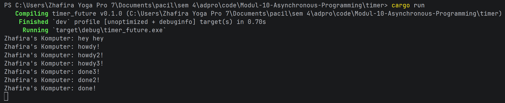
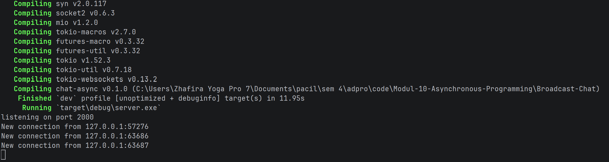
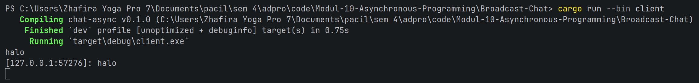
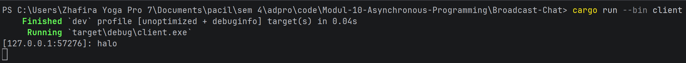

# Tutorial 1: Timer

## Experiment 1.2: Understanding how it works.

Berdasarkan hasil eksekusi di atas, urutan teks yang tercetak di terminal adalah:
1. `Zhafira's Komputer: hey hey`
2. `Zhafira's Komputer: howdy!`
3. `Zhafira's Komputer: done!`

Teks `"hey hey"` muncul paling awal sebelum kode di dalam `spawner.spawn` dijalankan karena adanya beberapa hal seperti
1. Sifat Kelambatan Future (Lazy Evaluation) di mana dalam bahasa pemrograman Rust, sebuah blok asinkron 
(`async { ... }`) atau objek yang mengimplementasikan `Future` bersifat lazy. Artinya, ketika kita memanggil fungsi 
`spawner.spawn(...)`, Rust tidak akan langsung mengeksekusi baris kode yang ada di dalam blok tersebut. Fungsi `spawn`
hanya bertugas membungkus kode itu menjadi sebuah *task* dan memasukkannya ke dalam antrean tugas (`ready_queue`).

2. Eksekusi Sinkronus Lebih Utama di mana baris perintah `println!("...: hey hey");` ditulis secara terpisah di luar
blok asinkron. Karena berada di alur eksekusi utama yang bersifat synchronous, perintah ini akan langsung dieksekusi
oleh CPU secara instan saat alur program melewatinya, bahkan sebelum task asinkron di antrean sempat dilirik.

3. Peran Utama Executor di mana blok kode asinkron yang berisi `"howdy!"` dan `"done!"` baru benar-benar diproses dan
diperiksa ketika program menyentuh perintah `executor.run();` di baris paling bawah fungsi `main`. Executor inilah yang
bertugas mengambil tugas dari antrean dan menjalankannya, sehingga pesan asinkron baru muncul setelah pesan sinkronus
`"hey hey"` selesai dicetak.

## Experiment 1.3: Multiple Spawn and removing drop

Berdasarkan hasil eksperimen ini, terdapat dua fenomena utama yang terjadi yaitu 

1. Interleaving atau Concurrency pada Multiple Spawn. Ketika kita menambahkan `spawner.spawn` kedua dan ketiga, ketiga
tugas asinkron tersebut berjalan secara konkuren. Output dari kedua tugas akan saling bergantian muncul di terminal
tergantung tugas mana yang menyelesaikan timer terlebih dahulu.

2. Adanya siklus ketergantungan deadlock antara komponen executor dan spawner. executor memproses antrean task
menggunakan loop `while let Ok(task) = self.ready_queue.recv()`. Metode `recv()` pada channel MPSC Rust secara inheren
bersifat blocking yang berarti perulangan tersebut akan terus berjalan dan terjaga untuk menunggu kiriman data baru
sampai saluran komunikasinya ditutup secara resmi. Di dalam sistem manajemen memori Rust, saluran MPSC hanya akan
menutup secara otomatis apabila seluruh objek pengirim data telah dropped dari memori. Ketika kita menghapus baris 
`drop(spawner);`, variabel `spawner` di dalam fungsi `main` akan tetap dianggap aktif oleh compiler. Kondisi aktifnya
`spawner` ini membuat saluran MPSC mengasumsikan bahwa masih ada kemungkinan task baru akan dikirimkan di masa
mendatang, sehingga executor menolak untuk menghentikan loop `recv()`. Di sisi lain, fungsi `main` juga tidak akan
pernah bisa mencapai akhir baris kode untuk menghancurkan `spawner` secara otomatis karena alur eksekusi utamanya sudah
terlanjur tertahan tanpa henti di dalam perintah `executor.run()`. Hubungan saling tunggu inilah yang mengunci jalannya
program dan membuatnya menggantung selamanya di terminal.

# Tutorial 2: Broadcast Chat
## Experiment 2.1: Original code, and how it run
Berikut adalah screenshot dari hasil eksekusi program ketika menjalankan 1 chat server dan 3 chat client secara
bersamaan:

### Panduan Menjalankan Program
Untuk mereplikasi hasil eksekusi di atas, berikut adalah langkah-langkah pemanggilan menggunakan beberapa terminal
terpisah:
1. Menjalankan Server: Buka terminal utama dan jalankan perintah `cargo run --bin server`. Terminal ini berfungsi
sebagai pusat pengendali jaringan yang mendengarkan koneksi masuk pada port `2000`.
2. Menjalankan Multiple Client: Buka tiga jendela terminal baru yang terpisah, kemudian eksekusi perintah
`cargo run --bin client` pada masing-masing terminal tersebut untuk mensimulasikan tiga pengguna yang berbeda.
3. Interaksi Obrolan: Ketikkan pesan teks di salah satu jendela klien lalu tekan `Enter`. Pesan tersebut akan langsung
disebarkan dan muncul di seluruh terminal klien lainnya secara real-time.

### Analisis Alur Kerja dan Mekanisme Asinkron
Keberhasilan interaksi komunikasi data tanpa hambatan pada aplikasi obrolan ini didasarkan pada dua pilar utama 
arsitektur asinkron yang disediakan oleh ekosistem Tokio di Rust yaitu 
1. Konkurensi Jaringan Jelas Melalui`tokio::select!` di mana baik pada komponen klien maupun server, terdapat makro
`tokio::select!` yang berjalan di dalam perulangan tak terbatas (`loop`). Makro ini bertugas untuk mengawasi beberapa
futures secara bersamaan. Sebagai contoh, di sisi klien, program harus siap membaca input ketikan pengguna dari terminal
sekaligus mendengarkan paket data baru yang datang dari jaringan internet. Jika aplikasi ini ditulis secara sinkronus
biasa, proses membaca ketikan terminal akan mengunci jalannya program sehingga pesan dari pengguna lain tidak akan bisa
muncul sebelum pengguna tersebut menekan tombol Enter. Dengan `tokio::select!`, tugas mana pun yang menerima data
terlebih dahulu akan langsung dilayani tanpa memedulikan tugas lainnya yang masih tertidur pending.

2. Mekanisme Distribusi Data Menggunakan `tokio::sync::broadcast`. Ketika server menerima string pesan dari salah satu
klien melalui aliran data WebSocket (`WebSocketStream`), server tidak langsung mengirimkannya satu per satu ke klien
lain secara manual. Alih-alih demikian, server memanfaatkan broadcast channel. Pesan yang diterima akan langsung
dimasukkan ke dalam ujung pengirim saluran (`bcast_tx`). Karena setiap koneksi klien yang masuk telah terdaftar dan
subscribed ke saluran tersebut melalui `bcast_tx.subscribe()`, ujung penerima masing-masing koneksi (`bcast_rx`) akan
mendeteksi adanya data baru secara asinkron. Kejadian ini langsung memicu pembungkusan data kembali ke dalam protokol
WebSocket untuk ditembakkan menuju terminal klien masing-masing secara paralel dan instan.

## Experiment 2.2: Modifying port
Proses pengalihan port komunikasi dari `2000` menjadi `8080` pada broadcast chat ini melibatkan modifikasi terstruktur 
pada kedua belah pihak jaringan karena sistem menggunakan arsitektur client-server. Pada sisi server yang berada di
dalam file `src/bin/server.rs`, perubahan dilakukan pada fungsi pemikatan local socket `TcpListener::bind` agar sistem
operasi membuka port `8080` untuk mendengarkan koneksi masuk. Secara sinkron, modifikasi juga wajib diterapkan pada sisi
klien di dalam file `src/bin/client.rs` dengan menyesuaikan target pencari lokasi sumber seragam
(`ClientBuilder::from_uri`) menjadi `ws://127.0.0.1:8080`. Sinkronisasi pengubahan pada kedua file ini sangat krusial
karena ketidaksesuaian penetapan port antara klien dan server akan langsung menggagalkan proses penghubungan jaringan
dan memicu eror penolakan koneksi.

Mengenai karakteristik komunikasi jaringan yang terjadi, baik klien maupun server tetap mempertahankan pemakaian
protokol WebSocket yang sama untuk menjamin pertukaran data dua arah secara full-duplex dan real-time. Keberadaan
protokol ini didefinisikan secara eksplisit pada kode klien melalui penggunaan skema URI berawalan `ws://`, yang secara
spesifik memerintahkan pustaka jaringan untuk menginisialisasi jabat tangan WebSocket, bukan HTTP konvensional. Di sisi
server, penegasan protokol ini terjadi secara implisit ketika aliran data TCP mentah (`TcpStream`) dibungkus dan
divalidasi menggunakan ekspresi asinkron `ServerBuilder::new().accept(socket).await` untuk menangani siklus hidup
koneksi. Secara struktural, seluruh aturan baku mengenai message framing dan manajemen soket ini diatur oleh pustaka
eksternal `tokio_websockets` yang telah dideklarasikan secara terpusat di dalam konfigurasi `Cargo.toml`..