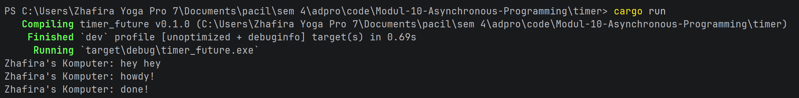

# Tutorial 1: Timer

# Experiment 1.2: Understanding how it works.

#### Hasil Eksekusi Program

Berdasarkan hasil eksekusi di atas, urutan teks yang tercetak di terminal adalah:
1. `Zhafira's Komputer: hey hey`
2. `Zhafira's Komputer: howdy!`
3. `Zhafira's Komputer: done!`

Teks `"hey hey"` muncul paling awal sebelum kode di dalam `spawner.spawn` dijalankan karena adanya beberapa hal seperti
1. Sifat Kelambatan Future (Lazy Evaluation) di mana dalam bahasa pemrograman Rust, sebuah blok asinkron 
(`async { ... }`) atau objek yang mengimplementasikan `Future` bersifat lazy. Artinya, ketika kita memanggil fungsi 
`spawner.spawn(...)`, Rust tidak akan langsung mengeksekusi baris kode yang ada di dalam blok tersebut. Fungsi `spawn`
hanya bertugas membungkus kode itu menjadi sebuah *task* dan memasukkannya ke dalam antrean tugas (`ready_queue`).

2. Eksekusi Sinkronus Lebih Utama di mana baris perintah `println!("...: hey hey");` ditulis secara terpisah di luar
blok asinkron. Karena berada di alur eksekusi utama yang bersifat synchronous, perintah ini akan langsung dieksekusi
oleh CPU secara instan saat alur program melewatinya, bahkan sebelum task asinkron di antrean sempat dilirik.

3. Peran Utama Executor di mana blok kode asinkron yang berisi `"howdy!"` dan `"done!"` baru benar-benar diproses dan
diperiksa ketika program menyentuh perintah `executor.run();` di baris paling bawah fungsi `main`. Executor inilah yang
bertugas mengambil tugas dari antrean dan menjalankannya, sehingga pesan asinkron baru muncul setelah pesan sinkronus
`"hey hey"` selesai dicetak.